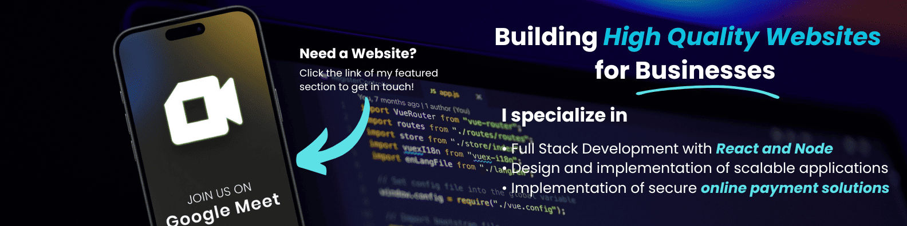
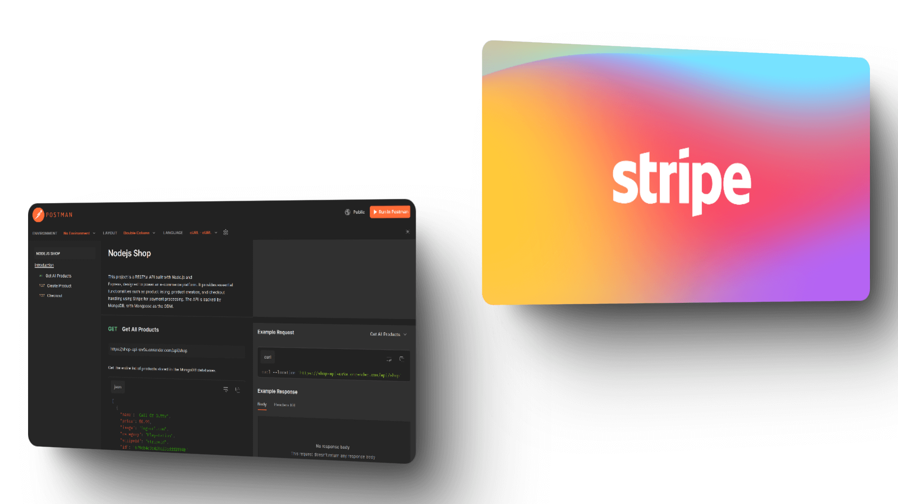
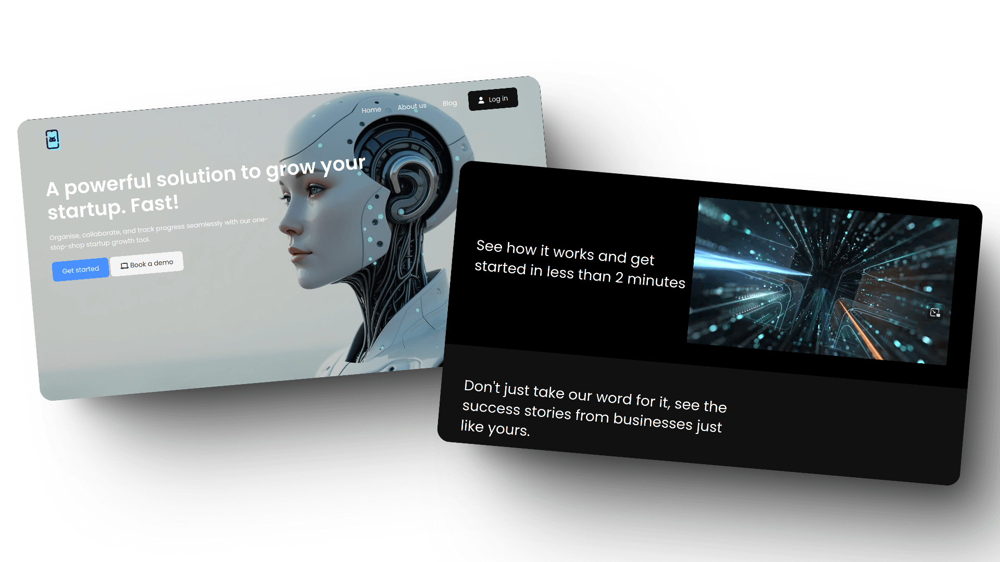

# Anthony Sandoval | Junior Software Engineer

Junior Software Engineer with expertise in full-stack development, specializing in React, Node.js, and RESTful APIs. Designed and implemented scalable applications, including a responsive e-commerce platform using Redux and Stripe, which achieved a 95% score on Lighthouse performance metrics. Developed secure backend APIs with Express and MongoDB, enhancing database efficiency and reliability.

I’m open to new opportunities where I can leverage my skills to build innovative solutions. Let’s connect!

- 📍 Dublin, Ireland

- 📧 [asxdev18@gmail.com](mailto:asxdev18@gmail.com)

- 🌐 [Portfolio](https://asxdev.com/)

- 🔗 [LinkedIn](https://www.linkedin.com/in/anthony-sandoval-dev/)

## 🚀 Projects

### React E-commerce Website

Fully responsive e-commerce website built with React, leveraging React Bootstrap for UI components and Redux Toolkit for state management. The project integrates an external API (backed by MongoDB) to fetch product data and uses Stripe for secure payment processing. It is optimized for performance using Vite.js as a build tool and is deployed on Netlify.

- Built a responsive e-commerce platform using React Bootstrap, Stripe API, and Redux Toolkit for state management.
- Integrated external APIs for product data and implemented real-time notifications with react-toastify.
- Optimized performance with Vite.js and deployed on Netlify for seamless accessibility.

🌐 Check it out 👉 [Joystick Jungle](https://joystickjungle.netlify.app/)

### Node.js Ecommerce API

RESTful API built with Node.js and Express, designed to power an e-commerce platform. It provides essential functionalities such as product listing, product creation, and checkout handling using Stripe for payment processing. The API is backed by MongoDB, with Mongoose as the ODM.

- Developed a product management system to fetch and create product listings, ensuring seamless integration and efficient product lifecycle management.
- Implemented a secure online payment solution using the Stripe API, enabling reliable and safe transactions for users.
- Designed and built a high-performance, scalable backend using Express and MongoDB, supporting future growth and increased user demand.
- Documented and hosted comprehensive API endpoint
  information using Postman Documentation, ensuring clear and accessible
  resources for developers.

🌐 Check it out here 👉 [Postman Docs](https://documenter.getpostman.com/view/31079873/2sAYX5M3M8)

### Saas Website

SaaS website designed to showcase a software-as-a-service product. Built with clean HTML and CSS, it features a mobile-friendly navigation menu powered by JavaScript, along with embedded media and CDN-based assets for optimized performance.

- Optimized modern and responsive design to deliver a seamless user experience across all devices, ensuring accessibility and usability.
- Enhanced typography and UI elements using Google Fonts and Font Awesome icons, achieving a polished and professional aesthetic.
- Deployed the project on Netlify for fast, reliable hosting with continuous integration, ensuring efficient updates and maintenance.

🌐 Check it out here 👉 [saas website](https://saas-wb.netlify.app/)

## 💻 Skills

  

## 💬 Have a question? Click the link to get in touch

📆 Schedule a meeting with me 👉 [meeting](https://cal.com/anthony-robert-sandoval-veliz-bsxsb5/15min)
